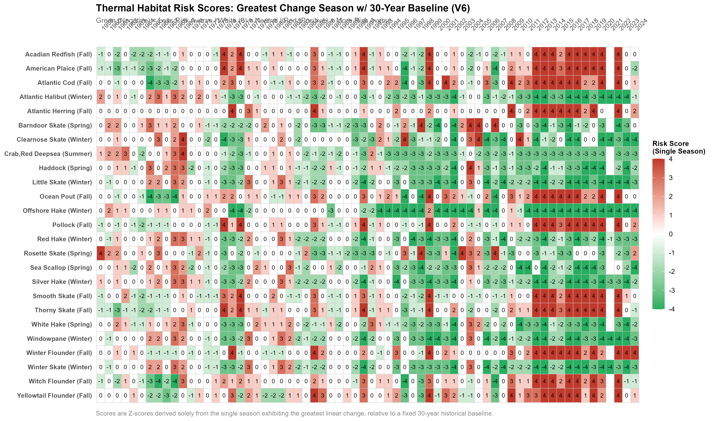

# NEFMC Thermal Habitat Indicators & Risk Scoring

## Overview
This repository contains the workflow for generating, evaluating, and scoring thermal habitat suitability indicators for species managed by the New England Fishery Management Council (NEFMC). These indicators are developed specifically to integrate into the NEFMC Risk Policy framework. 

The pipeline defines historic habitat footprints based on NEFSC bottom trawl survey strata, calculates the percentage of that habitat that is thermally suitable in a given year, and translates that timeseries into a discrete -4 to +4 risk score.

## Methodology: "The Greatest Change Season"
During the development of this indicator, we tested several methodologies (now documented in the `/archive` folder). We determined that calculating an annual average of seasonal habitat suitability masked critical thermal bottlenecks (e.g., a total collapse of summer habitat could be hidden by a stable winter). 

To maximize the sensitivity and protective nature of the indicator, the final V6 methodology:
1. Calculates the percentage of historic thermal habitat available in a given year.
2. Isolates the **single season** exhibiting the greatest linear change for each species.
3. Calculates a discrete Risk Score based on a fixed **30-year climatological baseline**.

## Workflow & Key Scripts
The production pipeline is housed in the `R/` directory and is designed to be run sequentially:

1. **`00_get_historic_habitat_V6_seasonal.R`**: Builds the spatial footprint (V6) based on survey strata containing >= 3 historical observations.
2. **`01_get_perc_suitable_thermal_habitat_seasonally.R`**: Intersects the habitat footprints with GLORYS daily bottom temperatures to calculate the annual percentage of suitable thermal habitat.
3. **`02_plot_perc_suitable_thermal_habitat_one_season.R`**: Identifies the "Greatest Change Season" per species and generates visual time series.
4. **`03_thermal_suitability_z_scoring_30yr_baseline_V6_one_season.R`**: Converts the raw percentages into Z-scores relative to the 30-year fixed baseline, scaling them to the -4 to +4 Risk Policy framework.
5. **`04_plot_risk_score_heatmaps_V6_one_season.R`**: Generates the final all-species summary heatmap tables.

*(Note: Essential data-pulling and mathematical functions are prefixed with `utils_` in the `R/` folder).*

## Final Output
The primary output of this pipeline is the All-Species Risk Score Heatmap, showing the thermal risk trajectory of each species driven by its most volatile season.

## Data Access: Bottom Temperature NetCDF
Due to file size constraints, the historical bottom temperature dataset (1959-2021) is **not** hosted in this repository. To run the indicator scripts, you must download the data locally.

The data is a combined GLORYS and bias-corrected ROMS time series hosted on the NEFSC ERDDAP server.

**Download Instructions:**
1. Navigate to the dataset on ERDDAP: [duPontavice_bottom_temp](https://comet.nefsc.noaa.gov/erddap/griddap/duPontavice_bottom_temp.html)
2. Adjust the time slider to encompass the full time series (1959-01-02 to 2021-01-01).
3. Under **File type**, select `.nc` (NetCDF-3 or NetCDF-4). *Do not download as a .csv or .htmlTable, as it will crash your R session.*
4. Save the downloaded file as `duPontavice_bottom_temp.nc` in your local directory at:
   `data-raw/duPontavice_bottom_temp.nc` 
   *(Note: If you save it elsewhere, you must update the `nc_file` path in `get_perc_suitable_thermal_habitat.R`)*

## Dependencies
This project relies heavily on the spatial ecosystem within R. Ensure you have the following packages installed:
* `tidyverse`
* `sf`
* `terra` (for lazy-loading NetCDF files)
* `exactextractr` (for fast raster-polygon extraction)
* `here`
* `marmap`
* `broom`

---

## Disclaimer
This repository is a scientific product and is not official communication of the National Oceanic and Atmospheric Administration, or the United States Department of Commerce. All NOAA GitHub project code is provided on an ‘as is’ basis and the user assumes responsibility for its use. Any claims against the Department of Commerce or Department of Commerce bureaus stemming from the use of this GitHub project will be governed by all applicable Federal law. Any reference to specific commercial products, processes, or services by service mark, trademark, manufacturer, or otherwise, does not constitute or imply their endorsement, recommendation or favoring by the Department of Commerce. The Department of Commerce seal and logo, or the seal and logo of a DOC bureau, shall not be used in any manner to imply endorsement of any commercial product or activity by DOC or the United States Government.